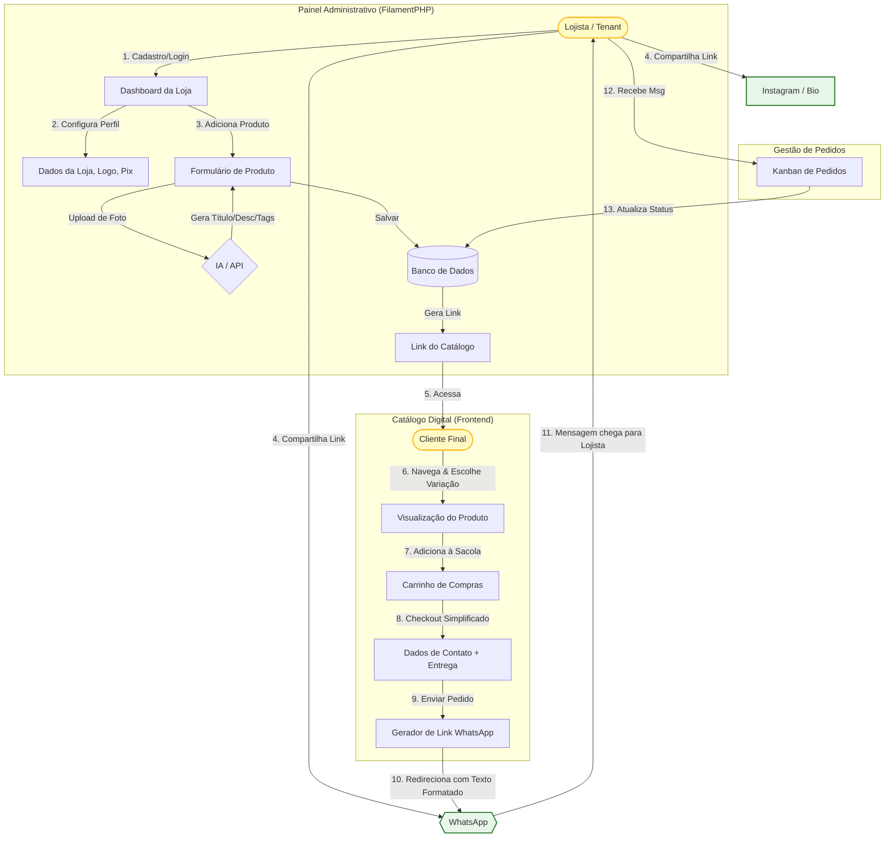

# SGEP - Sistema Gestor de Empresas e Pedidos Lite
###### Escopo inicial do projeto

---

#### 1. Fluxograma da Jornada do Usuário (BPMN Style)

Este fluxo mostra como o Lojista (Tenant) e o Cliente interagem através da plataforma e onde a IA entra.

#### 2. Descrição Técnica do Fluxo (Para Documentação)

- Fase 1: Onboarding e Catálogo (Lojista)
    - Input: O lojista cria a conta e configura a loja (Nome, Slug da URL, Cores, Telefone WhatsApp).
    - Gestão de Estoque: O lojista cadastra produtos.
    - Feature IA: O sistema oferece um botão "Preencher com IA". Ao fazer upload da imagem, a IA analisa e sugere título, descrição comercial e hashtags.
    - Variantes: Criação de SKUs filhos (ex: Tamanho, Cor) vinculados ao produto pai.
    - Output: O sistema gera uma URL única (app.com/loja-do-joao).

- Fase 2: Experiência de Compra (Cliente)
    - Acesso: O cliente entra no link (via Bio do Instagram ou mensagem direta).
    - Seleção: Interface reativa (Livewire) permite filtrar produtos e selecionar variantes. O estoque é checado em tempo real.
    - Checkout: Não há login/senha para o cliente (redução de fricção). Apenas nome, telefone e endereço.
    - Disparo: O sistema compila os dados em uma string codificada e abre a API do WhatsApp (wa.me).

- Fase 3: Negociação e Fulfillment (Pós-Clique)
    - Handshake: A conversa inicia no WhatsApp pessoal do lojista com todos os detalhes do pedido.
    - Registro: O sistema (opcionalmente) salva esse "abandono de carrinho/intenção de compra" no painel administrativo como um "Pedido Pendente" para que o lojista possa acompanhar métricas de conversão.

#### 3. Estrutura de Banco de Dados Sugerida (Entidades Principais)

   - Tenants (Stores): id, user_id, slug, whatsapp_number, theme_color.
   - Products: id, tenant_id, name, description, base_price, is_active.
   - ProductVariants: id, product_id, name (ex: "Azul - M"), price_modifier, stock_qty.
   - Orders: id, tenant_id, customer_name, customer_phone, total_amount, status (Novo, Em Separação, Concluído), payload_dump (json do pedido original).
   - OrderItems: id, order_id, product_variant_id, quantity, unit_price.

#### 4. Modelo de Negócio (Planos)

   - Plano "Vitrine" (Grátis):
       - Até 3 produtos ativos.
       - Sem variações complexas (só produto simples).
       - Link genérico (suaplataforma.com/loja/usuario).

   - Plano "Vitrine Lite" (R$ 19,90):
       - Até 5 Produtos ativos.
       - Controle de Variações (Cor/Tamanho).
       - Gestão de Pedidos (Kanban).

   - Plano "Vitrine Pro" (R$ 39,90):
       - Produtos e fotos ilimitadas.
       - Controle de Variações (Cor/Tamanho).
       - Gestão de Pedidos (Kanban).
       - Botão "Gerar Legenda IA".

   - Plano "Vitrine Super" (R$ 99,00/mês):
       - Domínio próprio.
       - Integração com Pixel do Facebook (para quem faz tráfego pago).
       - Remoção da marca da sua plataforma.

#### 5. To-Do para o Futuro (Roadmap Varejo):

   - Catálogo PDF Automático: Muitos revendedores (ex: Natura, Tupperware, Roupas) gostam de mandar PDF. Crie um botão que converte a loja online atual em um PDF bonitão para compartilhar em grupos.
   - Integração com Instagram Shopping (Bag): Gerar o XML necessário para o lojista conseguir colocar a "sacolinha" no Instagram levando para o seu checkout.
   - Botão "Avise-me quando chegar": Captura de leads para produtos sem estoque.

--- 

#### Pensando como Desenvolvedor:

- Modelagem de Dados: O desafio aqui será a tabela de skus ou product_variants. Usar uma estrutura onde a tabela products é o pai, e variants segura o estoque e o preço específico (se variar).
- Performance: Como é varejo, imagens pesadas são comuns. Use o Spatie Media Library no Laravel para otimizar e gerar thumbs automaticamente, garantindo que o catálogo carregue rápido no 4G do cliente.
